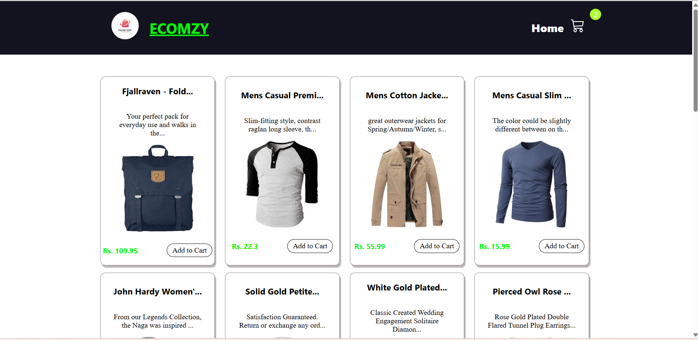
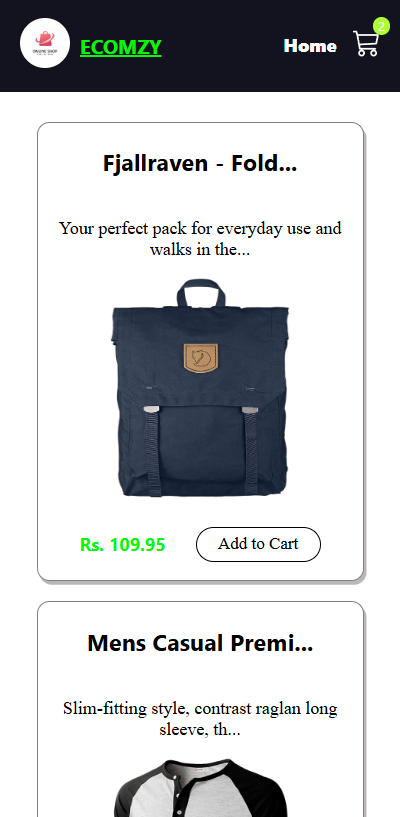
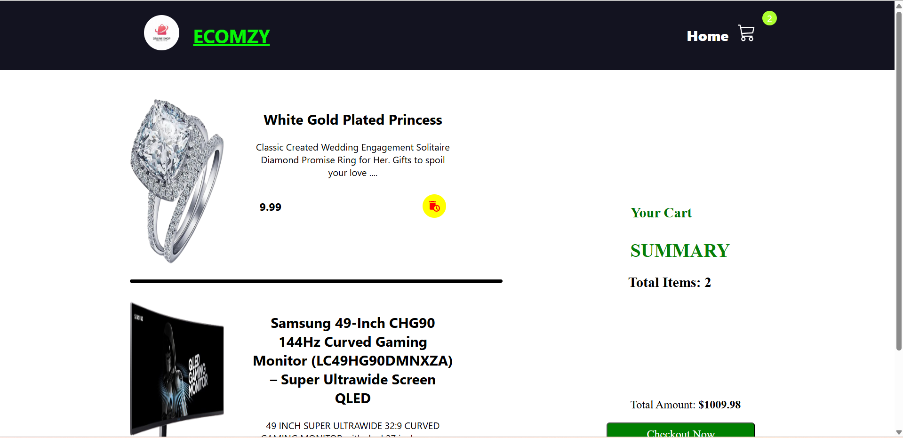
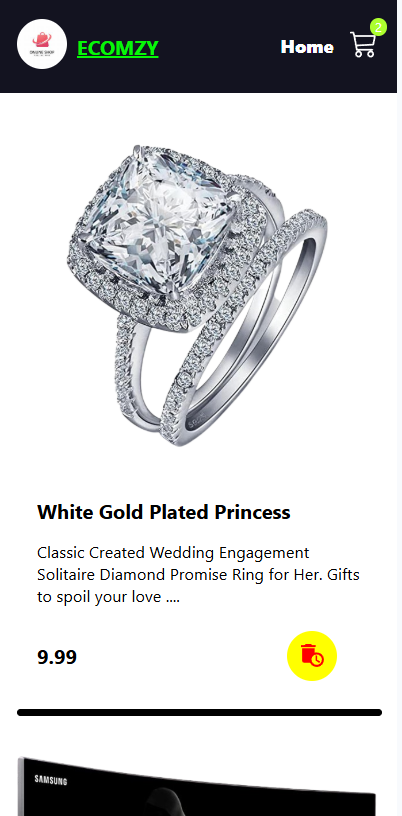
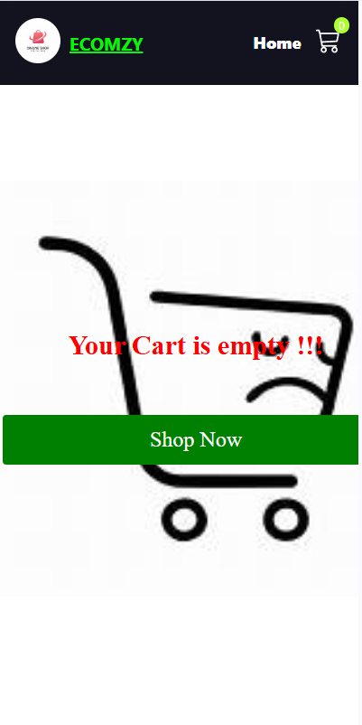

## 🛒 Ecomzy – React & Redux eCommerce Website

*Ecomzy is a fully responsive frontend eCommerce website built using React and Redux. It fetches product data from an external API and displays products in a clean card-based layout. Users can add and remove products from the cart with real-time updates using Redux state management.*

**🚀 Features**
   1. Fetches products dynamically from an API

   2. Displays products in responsive card layout

   3. Product card includes:

      - Image

      - Title

      - Short description

      - Price

      - Add to Cart / Remove from Cart button

   4. Add to Cart button toggles to Remove from Cart

   5. Redux-powered cart state management

   6. Navbar with:

      - Logo and website name (left)

      - Home link and Cart icon (right)

      - Cart icon shows total number of items in the cart

   7. Cart page includes:

      - Product image

      - Full description

      - Price

      - Remove (dustbin) button

   8. Cart summary section:

      - Total number of items

      - Total cart amount

      - Checkout button (UI only)

   9. Fully responsive design for mobile, tablet, and desktop

   10. Toast notifications for add/remove actions

**🛠️ Tech Stack**
   - React.js

   - Redux Toolkit

   - React Router DOM

   - CSS

   - React Icons

   - React Toastify

   - External REST API

**📂 Project Structure (Simplified)**

src/
│── components/
│   ├── CartItem.jsx
│   ├── Products.jsx
│   └── Spinner.jsx
|   └── Spinner.css
│
│── pages/
│   ├── Home.jsx
│   └── Cart.jsx
|   └── Navbar.jsx
│
│── redux/
│   └── slices/
│       └── CartSlice.jsx
|   └── store.js
│
|── App.css
│── App.js
│── index.css
│── index.js

**⚙️ Functionality Overview**
   - Products are fetched from an API and stored in local state

   - Cart state is managed globally using Redux

   - Add to Cart updates Redux store and UI instantly

   - Remove from Cart updates Redux store and UI instantly

   - Cart icon dynamically updates item count

   - Checkout button is for UI demonstration only (no backend)

**📱 Responsive Design**
   - Mobile-friendly layout using CSS media queries

   - Adaptive product cards

   - Optimized cart layout for small screens

   - Smooth user experience across all devices

**📷 Screenshots**

## Home Page

## Home Page (Mobile)

## Cart Page

## Cart Page (Mobile)

## Empty Cart Page (Mobile)

**👨‍💻 Author**
    *- Sourabh (https://github.com/Sourabh108-Coder/)*
